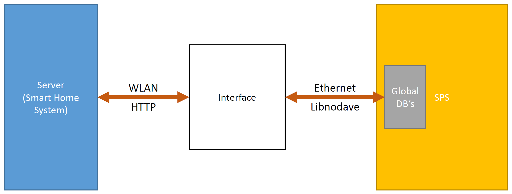
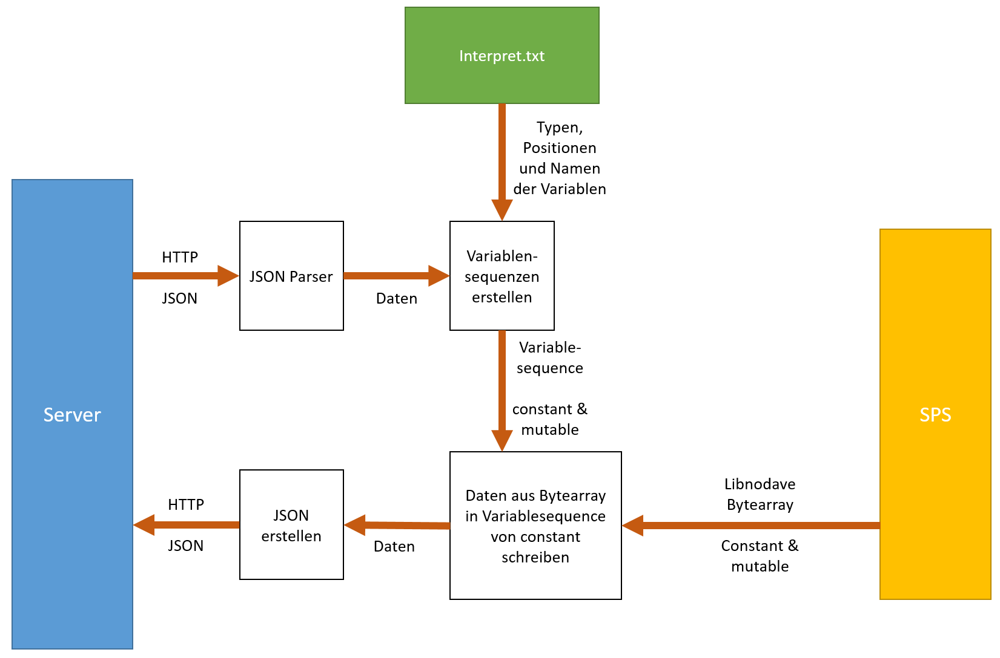
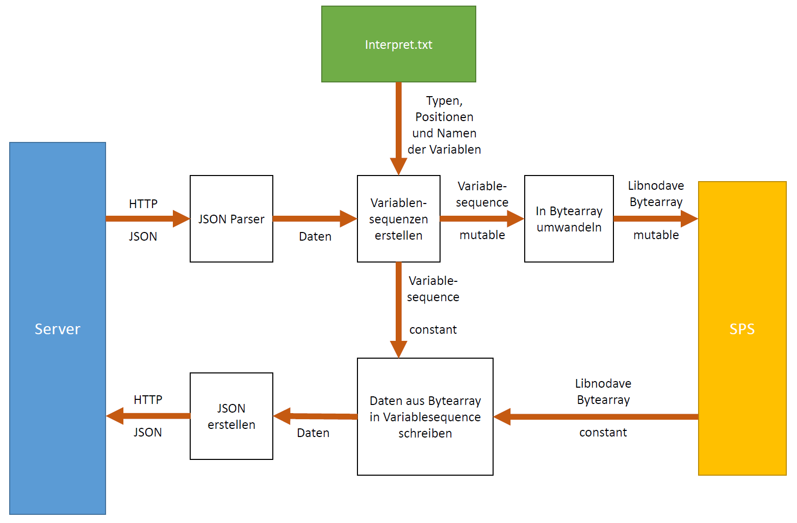

# GFS Smarthome-SPS-Interface (Dokumentation)

## Einleitung

Das Ziel unserer GFS war die Entwicklung eines Interfaces, das die Kommunikation zwischen dem Smart Home System des CT-Kurses der 13 Klasse und einer SPS ermöglicht.

Damit ist es möglich auch größere Systeme, wie Rasensprenger über das Smart Home System anzusteuern.

### Steuerung der SPS über das Smart Home System

Um die SPS über das Smart Home System zu steuern, werden variablen in einem Global DB der SPS geändert. Das Programm, das auf der SPS läuft, kann dann diese Daten verwenden.
Dafür holt sich das Interface diese Daten aus dem Smart Home System und schreibt sie in den zugehörigen Global DB der SPS.

### Senden von Daten aus der SPS an das Smart Home System

Um Daten aus der SPS an das Smart Home System zu senden, müssen diese in einem bestimmten Global DB stehen. Dieser ist ein anderer als der Global DB für das senden von Daten an die SPS. Das Interface ließt diese Daten aus dem Global DB aus und schickt sie an das Smart Home System.

## Entwicklung und Herausforderungen

### Einarbeitung

Da wir noch nie zuvor mit einer SPS gearbeitet hatten, mussten wir uns zunächst darüber informieren, was eine SPS ist und wie man diese ansteuern kann.

Dafür wurde uns eine Virtuelle Maschine gegeben, auf der das TIA-Portal installiert ist. Dieses ist die Entwicklungsumgebung, mit der man eine SPS programmieren kann und diese auch simulieren kann.

Um die SPS anzusteuern sollten wir Daten in einen Global DB der SPS schreiben und aus einem Global DB herauslesen. Dafür mussten wir eine Bibliothek suchen, über die wir Zugriff auf die DB's der SPS bekommen. Wir verwenden dafür Libnodave.

Libnodave ist eine freie Bibliothek für verschiedene Hochsprachen, die es ermöglicht auf den Speicher einer SPS zuzugreifen.

Um mit Libnodave auch auf die simulierte SPS in unserer VM zugreifen zu können, brauchten wir das Programm NetToPLCsim, das es möglich macht auch auf die simulierte SPS zuzugreifen.

Damit konnten wir im Dezember 2019 ein erstes Programm schreiben, mit dem wir einzelne Variablen, die in einem GlobalDB der simulierten SPS gespeichert waren, auslesen und ändern konnten.

### Entwicklung des Interfaces

Danach haben wir mit dem Entwickeln deseigentlichen Interfaces begonnen.

Ursprünglich wollten wir keinen Unterschied zwischen den Daten machen, die vom Server an die SPS gesendet werden und den Daten, die von der SPS an den Server gesendet werden. Das führte allerdings dazu, dass die Daten, die in eine Richtung gehen sollten teilweise mit den Daten für die andere Richtung überschrieben wurden.

Diese Herausforderung wurde gelöst, indem wir beide Wege komplett voneinander getrennt haben. Beide Wege haben jetzt jeweils ihren eigenen Global DB.
Dadurch ist es allerdings nicht mehr möglich einen Wert durch den Server zu ändern, anschließend von der SPS zu ändern und diesen geänderten Wert dann im Server anzuzeigen.
Das Programm in der SPS muss sich also darum kümmern, dass der Global DB für die Daten vom Server zur SPS nur ausgelesen und nicht beschrieben wird.

Eine weitere Herausforderung war, dass Libnodave uns nicht sagen kann, welche Variablen an welcher Position im Global DB gespeichert sind und welche Typen sie haben. Diese Informationen sind allerdings wichtig, um die Daten korrekt zu interpretieren. Deshalb haben wir die Datei `interpret.txt` eingeführt, die vom Benutzer angelegt werden muss und dem Interface Informationen über die verwendeten Variablen, ihre Typen und ihre Position im Speicher der SPS gibt.

Außerdem werden nicht alle Variablen direkt hintereinander in einem DB der SPS gespeichert.  
Ein Bit große Variablen können direkt hintereinander gespeichert werden. Das heißt bis zu 8 von diesen in einem Byte.  
Ein Byte große Variablen können nur ganze Byte-Adressen haben. Wenn das Byte davor nur zum Teil mit Bitvariablen gefüllt ist, wird der restliche Speicherplatz dieses Bytes freigelassen. Zwei je ein Byte große Variablen können in zwei hintereinanderliegenden Bytes gespeichert werden.  
Variablen die zwei Byte groß oder größer sind, können nur an geraden Speicheradressen gespeichert werden. Das bedeutet, das wenn an Adresse 2 eine 1 Byte große Variable gespeichert ist und danach eine 2 Byte große, dann wird die Adresse 3 ausgelassen und die zweite Variable fängt an Adresse 4 an.

Dies führte dazu, dass wir erst keine hintereinander liegende Variablen auslesen konnten, da wir erst diese Regeln verstehen mussten.

Mittlerweile funktioniert das Interface und es wurde mehrfach mit der simulierten SPS und dem Server des Smarthome Systems getestet.

## Funktionsweise des fertigen Interfaces

Unser Interface läuft auf einem Banana Pi.

Das Interface trennt die Variablen, die der Server in der SPS ändert und die Variablen, die der Server aus der SPS liest:

Die Variablen, die der Server in der SPS ändert, werden `mutable` genannt.

Die Variablen, die vom Server aus der SPS gelesen werden, werden `constant` genannt.

`mutable` und `constant` Variablen sind jeweils in einem eigenen Global DB der SPS gespeichert.

Das Programm durchläuft drei Zustände:

1. Initialization: Das Interface wird mit dem Server verbunden und erhält einen `Authcode`. Außerdem wird
das Interface mit der SPS verbunden.
2. Setup: Das Interface liest sowohl die als `constant` als auch die als `mutable` markierten Variablen aus der SPS aus und sendet sie an den Server. Dadurch erhält der Server zu beginn die tatsächlichen Werte der Variablen.
3. Update: Der Normalbetrieb. Das Interface liest die `mutable` Variablen aus dem Server aus und schreibt sie in die SPS. Dann werden die `constant` Variablen aus der SPS ausgelesen und an den Server gesendet.

Wenn ein Fehler während einem der Zustände auftritt, wird fünf mal erneut versucht die Aktionen auszuführen. Wenn auch beim fünften Versuch ein Fehler auftritt, wird das Programm beendet.

Bei jeder Interaktion mit dem Server, erhält das Interface ein `Requesttimeout`. Das Interface wartet die darin definierte Zeit, bis es wider etwas an den Server sendet.

### Initialization

Das Interface sendet einen HTTP GET request an die Datei `pair.php` im Server. Dieser sendet dann einen `Authcode` und ein `Requesttimeout` zurück an das Interface. Diese werden im Interface gespeichert.
Außerdem verbindet sich das Interface mit der SPS.

### Setup

Das Interface sendet einen HTTP GET request an die Datei `interact.php` im Server. Dieser sendet dann eine Datei, die ein `Requesttimeout` und die Werte der `mutable` Variablen im JSON Format an das Interface.

In der Datei `interpret.txt`, die auf dem Banana Pi gespeichert ist, ist angegeben, welche Variablen es gibt, welche Typen diese haben, in welcher Reihenfolge sie im Speicher der SPS stehen, welche von ihnen `mutable` und welche `constant` sind und in welchem DB's sie stehen.

Mithilfe von `interpret.txt` werden Zwei `Variablesequences` erstellt, eine für die `mutable` Variablen und eine für die `constant` variablen.

In einer `Variablesequence` sind alle Variablen eines DB's mit Name, Typ und Wert aufgelistet.

Aus der SPS werden über Libnodave die tatsächlichen Werte der Variablen ausgelesen und in zwei `Bytearrays` (eines für `mutable` und eines für `constant`) gespeichert.

In einem solchen `Bytearray` sind die einzelnen Bytes des zugehörigen DB's binär abgespeichert. Diese Darstellung wird verwendet, um die Bedienung von Libnodave zu vereinfachen.

Diese Bytes werden dann anhand der in den `Variablesequences` angegebenen Typen interpretiert. Die sich daraus ergebenden Werte werden dann in die zugehörigen Variablen in den `Variablesequences` geschrieben.

Aus diesen Daten wird dann wieder eine JSON Datei erstellt und über ein HTTP POST an den Server gesendet.

### Update

Das Updaten der Daten läuft größtenteils gleich ab wie das Setup. Es werden allerdings nur die `constant` Variablen an den Server gesendet und die `mutable` Variablen werden in die SPS geschrieben.

Das Interface sendet einen HTTP GET request an die Datei `interact.php` im Server. Dieser sendet dann eine Datei, die ein `Requesttimeout` und die Werte der `mutable` Variablen im JSON Format an das Interface.

In der Datei `interpret.txt`, die auf dem Banana Pi gespeichert ist, ist angegeben, welche Variablen es gibt, welche Typen diese haben, in welcher Reihenfolge sie im Speicher der SPS stehen, welche von ihnen `mutable` und welche `constant` sind und in welchem DB's sie stehen.

Mithilfe von `interpret.txt` werden Zwei `Variablesequences` erstellt, eine für die `mutable` Variablen und eine für die `constant` variablen.

In einer `Variablesequence` sind alle Variablen eines DB's mit Name, Typ und Wert aufgelistet.

Die `mutable` `Variablesequence` wird in ein `Bytearray` umgewandelt und in die SPS geschrieben.

Aus der SPS werden über Libnodave die tatsächlichen Werte der `constant` Variablen ausgelesen und in ein `Bytearray` gespeichert.

In einem solchen `Bytearray` sind die einzelnen Bytes des zugehörigen DB's binär abgespeichert. Diese Darstellung wird verwendet, um die Bedienung von Libnodave zu vereinfachen.

Diese Bytes werden dann anhand der in der `Variablesequence` angegebenen Typen interpretiert. Die sich daraus ergebenden Werte werden dann in die zugehörigen Variablen in der `Variablesequence` geschrieben.

Aus diesen Daten wird dann wieder eine JSON Datei erstellt und über ein HTTP POST an den Server gesendet.

## Einrichten des Interfaces

[Siehe Wiki Seite des Projektes](https://github.com/floppyMike/SPS-Communication/wiki/SPS-Setup)

## Persönliches Resümee

### Michal

Durch die GFS habe ich gelernt wie man mit Git arbeitet. Vor der GFS habe ich immer alleine gearbeitet und nie kollaboriert. Während der GFS lernte ich über die möglichkeiten die git anbietet, um Beispielsweise Konflikte zwischen den `Branches` zu lösen. Zusätzlich habe ich ein paar Funktionalitäten in [github](https://github.com/) kennengelernt wie zum Beispiel `Actions` und `Github Pages`. Ich kann mir vorstellen, dass ich nächstes Jahr diese Funktionalitäten ausnutzen werde.

Auch lernte ich wie man Projekte strukturiert. Vorher habe ich immer die Struktur von Visual Studio genommen. Während der GFS fing ich an `CMake` zu benutzen. Es bietet die Möglichkeit das Projekt plattformunabhängig einzurichten und zu kompilieren. In der Zukunft werde ich `CMake` für C++ Projekte benutzen.

### Jens

Ich habe durch die GFS vor allem gelernt, mit einer SPS umzugehen. Bevor ich mit der GFS angefangen hatte, wusste ich kaum, was eine SPS überhaupt ist. Im Laufe der GFS habe ich gelernt, wie eine SPS aufgebaut ist, wozu man eine solche einsetzen kann und vor allem wie man eine SPS programmiert.
Außerdem habe ich jetzt ein besseres Gefühl dafür, wie man eine Software aufbaut.

Neben diesem Zugewinn fachlichen Wissen habe ich auch gelernt wie man sich in Themen einarbeitet, von denen man keine Ahnung hat. Alles im Bezug zur SPS und Kommunikation zwischen Systemen war für mich komplett neu und ich musste viel fragen und im Internet recherchieren. Die ich denke es ist sehr wichtig die Fähigkeit zu haben sich schnell in neue, größtenteils neue Bereiche einzuarbeiten.
